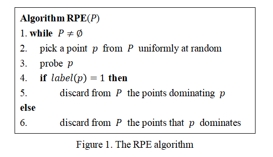

# Entity Matching with Quality and Error Guarantees

This repository contains the source code and datasets associated with the paper titled ["Entity Matching with Quality and Error Guarantees"](https://dl.acm.org/doi/abs/10.1145/3371316.3371323)

## Core Algorithm
<p align="center">
  
</p>

the algorithm can be described as a loop which continues until the point set P is empty. 
Firstly, it randomly selects a point p uniformly from the current P. 
Then, an oracle is invoked to reveal the true label of p, and add p to the probing set Z. 
Finally, the elimination is executed based on the label. If the label is 1, all points in P dominated by p are deleted. If the label is 0, all points in P that dominate p are deleted. 

## Dependencies

Create the conda environment from the provided YAML file:
```bash
conda env create -f RPE.yaml
```

## Run

```bash
python RPE.py
```